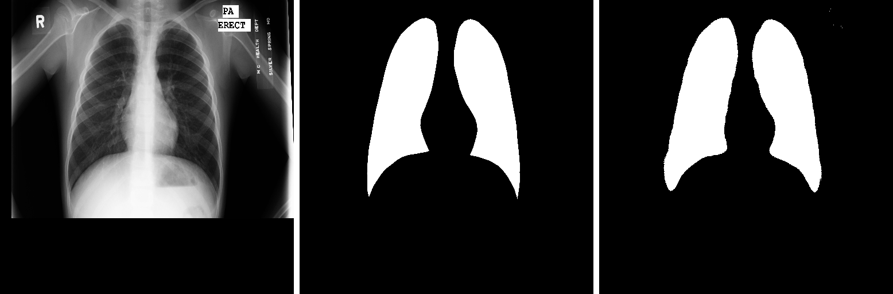
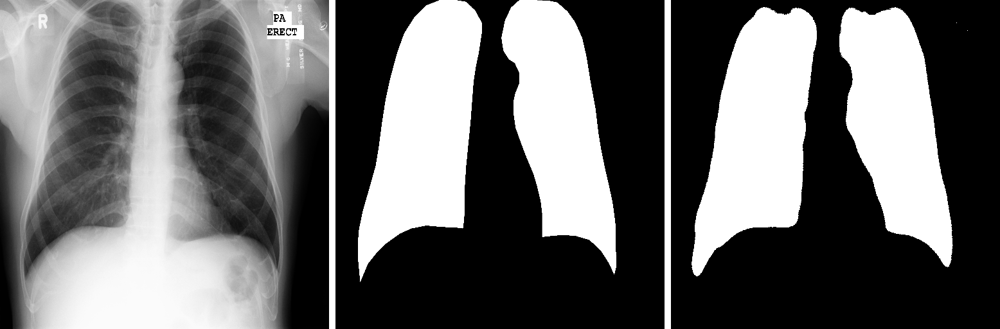
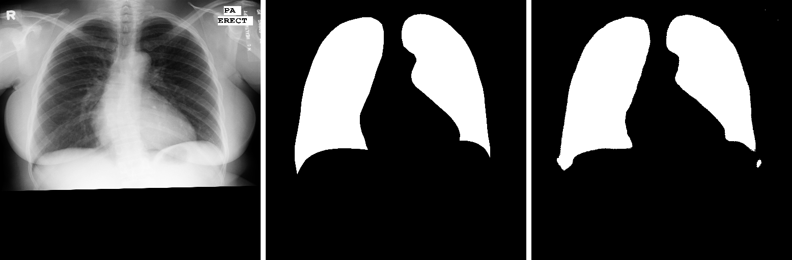

## 🩻 Lung Segmentation with TensorFlow 🩻
### Overview

This project aims to provide an efficient solution for lung segmentation in medical images using TensorFlow. Lung segmentation plays a crucial role in various medical imaging applications, including disease diagnosis, treatment planning, and research. By accurately delineating lung regions from chest radiographs or CT scans, healthcare professionals can better analyze pulmonary conditions and make informed decisions.

## ⚙️ U-Net Architecture ⚙️

## 🤞 Results 🤞

